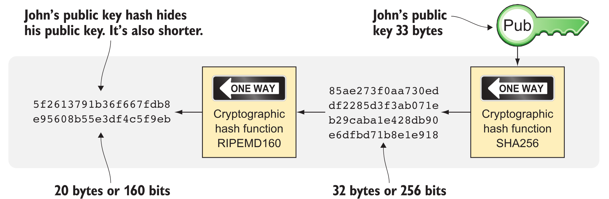

## Problems with money today->
 * Segreation ->
   - about 38% of the world’s population doesn’t have a bank account due to various reasons
   - people can’t expand their businesses outside their local communities. A merchant won’t be able to offer goods or services on the internet to increase its customer base
* Privacy Issues (electronic payment)-> 
   - traditional money poses several privacy problems. States can easily

     - Trace payments
     - Censor payments
     - Freeze funds
     - Seize funds

 * Inflation ->
   -  Inflation means the purchasing power of a currency decreases
   -  Hyperinflation -> extreme case
   -  increase of money supply from government -> decresase value
 * Borders->
   - exchange fiat currency from one to another -> bank commission 
   - moving it inside one 1 country -> convievent

## Bitcoin Approach -> 
  - Changing the rules of Bitcoin is nearly impossible without broad consensus. If a node doesn’t obey the rules, the rest of the nodes will ignore it. For example, one rule is that Bitcoin’s money supply is limited to 21 million bitcoins. This limit is nearly impossible to change because of decentralization; there’s no one you can threaten or bribe to change these rules.

  - Bitcoin money supply -> 21 million bitcoins
  - resistant to high inflation because you can’t increase the money supply at will.
  - Person (1 bitcoin) -> assures has (1/21 million) of total supply
  -  
  - Bitcoin **borderless**

## Cross-border payments->
  - moving money from one country to another is expensive (say, 15%), especially if you move money to a poor country, and the recipient doesn’t have a bank account.
  - 

## Shoping->
  - In traditional online payments, you send your debit card details to the merchant and hope the merchant will withdraw as much as you agreed on. You also hope the merchant handles your debit card details with great care. They probably store the details in a database. Think about that: for every debit card purchase you make, your card details will be stored in that merchant’s database. It’s likely that one of the databases will be hacked and your card details stolen. The more merchants store your details, the higher the risk.
## Noncurrency uses->
  - Ownership -> . Anyone can then verify that the manufacturer has transferred ownership of the car to the new owner. The new owner can show that she owns the car by proving that she owns the private key belonging to the public key to which the manufacturer has transferred ownership.

# How Bitcoin is valued->
  - Several Bitcoin exchanges exist->  resemble stock markets, where users wanting to sell bitcoins are matched with users wanting to buy bitcoins.

# When not to use Bitcoin->
  ## Tiny Payments->
    -   fee => size of transcations (bytes) , not on the value sent
          => traffic on blockchain -> The blockchain can’t handle more than roughly 12 MB of transactions per hour  -> higher fee -> more priority
    - Lightning Network
  
  ## Payment time ->
    -   The recipient sees the payment immediately but shouldn’t trust the payment until the Bitcoin network confirms it, which typically happens within 20 minutes

  ## Security -> 
     - You lose your private keys: the secrets you must have to spend your money.
     - Your private keys are stolen by some bad guy.
     -  The government in your location tries to crack down on Bitcoin users by imprisonment or other means of force.
     - The price of Bitcoin swings down dramatically due to rumors or speculation.
     - Software bugs make Bitcoin insecure.
     - Weaknesses arise in the cryptography Bitcoin uses.

**alt-coins** -> alteranate to bitcoin
**market cap** -> no of coins(money supply) * price of 1 coin
* she wants Wowcoin to have some real value, she must convince other people to begin using it. 
**Network Effect** ->   more people that adopt a particular technology or join a network, the more valuable that technology or network becomes. 
   

# Cryptographic hash-> 
  * 

  * SHA256 ->  (Secure Hash Algorithm with 256-bit/  32 bytes output)
  *  cryptographic hash function is a one-way function.
  *  hash len -> fixed && totally change on any change
  *  as an integrity check to detect changes in data.
  *  **pre-image** -> input 
  *  with extremely high probability, output a totally different hash when even the slightest variation of that pre-image is used. The hash is also commonly referred to as a **digest**
  
  ### Collision resistance-> 
      * You have only the cryptographic hash function at hand. It’s hard to find two different inputs that result in the same hash.

  ### Pre-image resistance
       * You have the hash function and a hash. It’s hard to find a pre-image of that hash.

  ### Second-pre-image resistance
      *  You have the hash function and a pre-image (and thus the hash of that pre-image). It’s hard to find another pre-image with the same hash.

## Digital Signatures->
 *  tied to  private key.
 
 * `private key` -> * creates public key 
                    * use to digital sign
 * `public key` -> * use to verify the signatures the private key creates.

 *  
*  

 * 
 
 * using random no generator -> `private-key`(32 bytes) -> `public-key deviation`(one way fn) -> public key(33 bytes)  

  * 
 * left side -> (for sending secret message) It’s used when two parties want to communicate in private, as when you do your online banking.
 * right side ->(not secret message) for digital signatures -> anyone can see

 ### Signing proce(ss -> 
 * message -> (sigining function) -> 32 bytes no -> (encrypt with private key) -> digital signature
 *  signature is an encrypted hash of a message.
*  

 * 

 ### Managing private key -> 
  * 

  #### Online vs. offline->
   * Online means the private key is stored on a device with network access,
   * Offline means the private key is stored on a piece of paper or a computer without any network access

  #### Cleartext vs. encrypted
  #### Whole key vs. split key

  ## Address -> 
   * 

 *  Replace names with public keys -> Lisa not require to maintian names with their public keys ->They must instead use the sender’s public key and the recipient’s public key 
 *  
*  

 * Public keys -> 33 bytes -> take up lot of space 

 * 