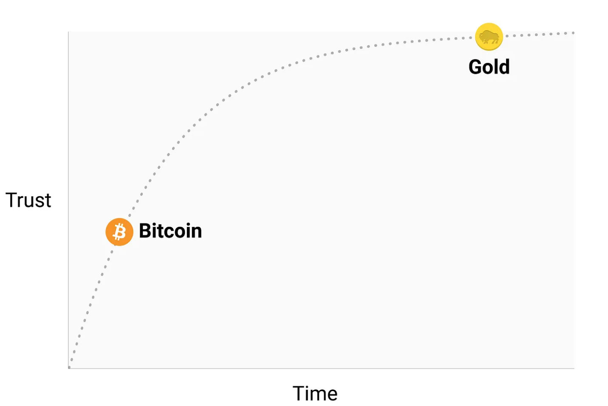

* **Byzantine General’s Problem** -> solution given by Satoshi (bitcoin)
* bitcoins cannot be valued using standard discounted cash flow analysis or by demand for their use in the production of higher order goods. Bitcoins fall into an entirely different category of goods, known as monetary goods, whose value is set game-theoretically. I.e., each market participant values the good based on their appraisal of whether and how much other participants will value it. 
## Properties of strore of value-> 
  ### Durability ->  
   * it is not their physical manifestation whose durability should be considered (since a tattered dollar bill may be exchanged for a new one), but the durability of the institution that issues them.
   *  Bitcoins, having no issuing authority, may be considered durable so long as the network that secures them remains in place
  ### Portablity -> 
   * Private keys representing hundreds of millions of dollars can be stored on a tiny USB drive and easily carried anywhere.
   * Fiat currencies, being fundamentally digital, are also highly portable. However, government regulations and capital controls mean that large transfers of value usually take days or may not be possible at all. Cash can be used to avoid capital controls, but then the risk of storage and cost of transportation become significant.
   ### Scaricity -> 
    bitcoin >= gold  > fiat (inflation)
    
    ### Established history-> 
    * fiat money cannot be trusted to maintain its value over the long or even medium term. Bitcoin, despite its short existence, has weathered enough trials in the market that there is a high likelihood it will not vanish as a valued asset any time soon.
    * 

### Evolution of Money -> 
  *  states have monopolized the issuance of money and continually undermined its use as a store of value, creating a false belief that money is primarily defined as a medium of exchange. Many have criticized Bitcoin as being an unsuitable money because its price has been too volatile to be suitable as a medium of exchange. This puts the cart before the horse, however. Money has always evolved in stages, with the store of value role preceding the medium of exchange role.