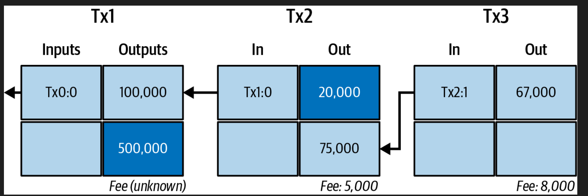
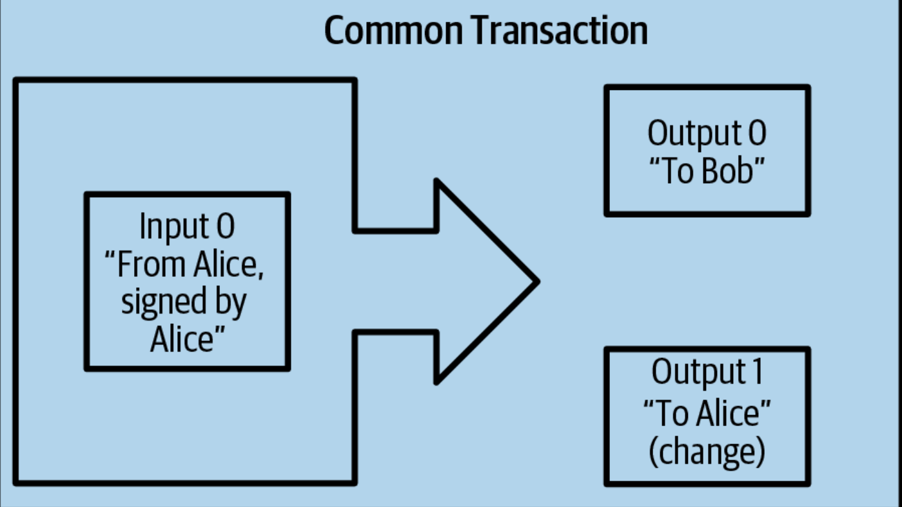
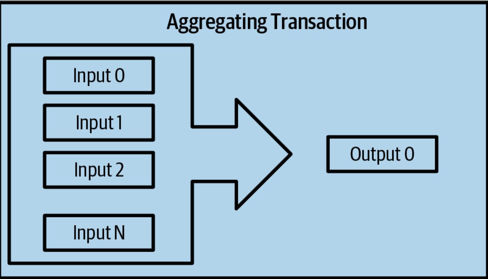
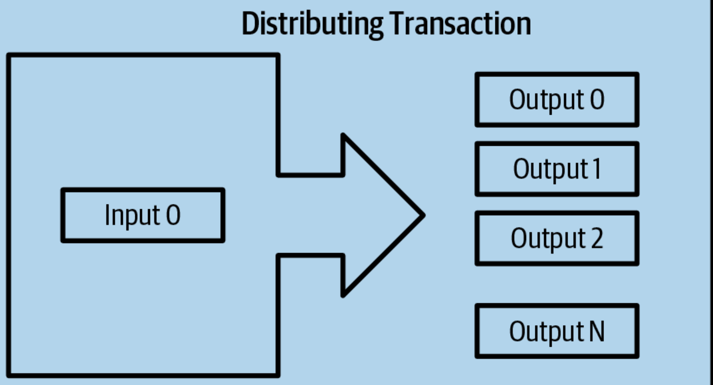

### Popular blockchain explorers->
 - Blockstream Explorer

 -Mempool.Space

 - BlockCypher Explorer

### Invoice QR code vs QR code-> 
 -  QR code that simply contains a destination Bitcoin address
 -  Invoice is a QR-encoded URI that contains a destination address, a payment amount, and a description
-  

###  Bitcoin Transcations-> 
 - tells the network that the owner of certain bitcoins has authorized the transfer of that value to another owner.
 - Transactions are like lines in a double-entry bookkeeping ledger.
 - when we spend bitcoin using wallet -> make digital signature 
 - 
 - #### Change Output-> 
    - get back change
    - When you make a Bitcoin transaction, you create outputs that specify where the bitcoins are going. Each output has an address associated with it.
    - In the Bitcoin protocol, whether you're sending bitcoins to someone else or sending the remaining bitcoins back to yourself (known as change), there's no technical difference.
    - **changeless transactions** -> bitcoin spend= bitcoin avaliable - fees
#### Coin Selection -> 
  *  wallets use different strategies when choosing which inputs to use in a payment,
  *   Unless the wallet can aggregate inputs in such a way to exactly match the desired payment plus transaction fees, the wallet will need to generate some change. This is very similar to how people handle cash.
  #### Forms of Transcation -> 
   - **Simple Payment** ->  
      - 
   - **consolidation transaction**-> 
     - Transactions like these are sometimes generated by wallets and businesses to clean up lots of smaller amounts.
     - 

   - **payment batching**-> 
     -  which pays to multiple outputs representing multiple recipients
     - 
 - Even if Alice's wallet app is offline, it can still create transactions. This is because the wallet already knows which bitcoins she owns and can prepare the transaction offline -> can spend to network after online.

